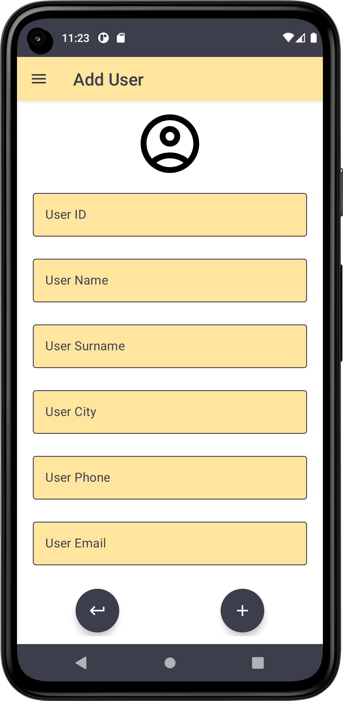

# ComposeRoomDatabase
> <b>Author: Nicola De Nicolais</b>

## 📍 Description
Android application built with Kotlin and Jetpack Compose that shows how to perform CRUD operations in the Room database using Android Architecture Components and the MVVM Architecture Pattern.

## ⚡ Structure
### Tech Stacks
#### Coroutines

Coroutines are blocks of code that are executed asynchronously without blocking the thread from which they are started. Coroutines can be implemented without having to worry about making complex AsyncTask implementations or managing multiple threads directly. Because of the way they are implemented, coroutines are much more efficient and require less resources than using traditional multi-threading options. Coroutines also make code that is much easier to write, understand and maintain as it allows you to write code sequentially without having to write callbacks to handle events and thread results.

#### Dagger Hilt

Hilt is a dependency injection library for Android that reduces the boilerplate of doing manual dependency injection in your project. Hilt provides a standard way to use DI in your application by providing containers for every Android class in your project and managing their lifecycles automatically. Hilt is built on top of the popular DI library Dagger to benefit from the compile-time correctness, runtime performance, scalability, and Android Studio support that Dagger provides.

#### Room

The Room persistence library provides an abstraction layer over SQLite to allow fluent database access while harnessing the full power of SQLite. Room is now considered as a better approach for data persistence than SQLiteDatabase and it makes it easier to work with SQLiteDatabase objects in your app, decreasing the amount of boilerplate code and verifying SQL queries at compile time.

### Jetpack Compose
#### Navigation

Navigation refers to the interactions that allow users to navigate across, into, and back out from the different pieces of content within your app. Android Jetpack's Navigation component helps you implement navigation, from simple button clicks to more complex patterns, such as app bars and the navigation drawer.

#### ViewModel

The ViewModel class is a business logic or screen level state holder. It exposes state to the UI and encapsulates related business logic. Its principal advantage is that it caches state and persists it through configuration changes. This means that your UI doesn’t have to fetch data again when navigating between activities, or following configuration changes, such as when rotating the screen.

#### LiveData
LiveData is an observable data holder class. Unlike a regular observable, LiveData is lifecycle-aware, meaning it respects the lifecycle of other app components, such as activities, fragments, or services. This awareness ensures LiveData only updates app component observers that are in an active lifecycle state.

## ✏️ Customization
You can customize the model used in the Room database that in the context of this app are users.

## 📎 Screen preview

